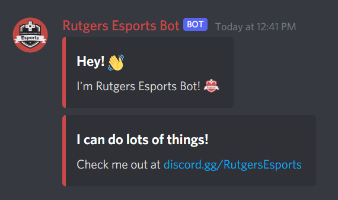

  

    <a href="https://discord.gg/RutgersEsports"></img></a>
    <a href="https://twitter.com/RutgersEsports"></img></a>
    <a href="https://instagram.com/rutgersesports"></img></a>
    <a href="https://twitch.tv/rutgersesports"></img></a>
    <a href="https://www.linkedin.com/company/rutgers-esports"></img></a>
    <a href="https://facebook.com/rutgersesports"></img></a>
    <a href="https://youtube.com/rutgersesports"></img></a>
    <a href="mailto:rutgersesports@gmail.com"></img></a>

---

# Rutgers Esports Discord Bot

The official **Rutgers Esports Bot** on Discord for handling all internal operations.

Built as a modular multi-purpose utility bot, with custom features such as creating embeds, moderation commands, and more.

## Table of Contents

-   [About The Project](#about-the-project)
-   [Tools & Technologies](#tools-and-technologies)
-   [Contributing](#contributing)
-   [Contributors](#contributors)

## About The Project

Rutgers Esports Bot is developed for ease of use with utility commands and features for gaming communities, clubs, and organizations.

-   **Community** - Members can easily access informative commands about their user/server, and also details about Rutgers Esports such as upcoming events.
-   **Moderation** - Built-in moderation commands are automatically provided and limited to server members with specific permissions.
-   **Executive Board** - Restricted features providing convenient automation and information to serve board members spanning all departments.

## Tools and Technologies

-   [Discord.py](https://discordpy.readthedocs.io/en/stable/) - Modern async/await API wrapper for Discord.
-   [Heroku](https://www.heroku.com/) - Hosting and deployment cloud platform.
-   [Firestore DB](https://firebase.google.com/) - Realtime NoSQL database for managing our inventory.
-   [Google Calendar API](https://developers.google.com/calendar) - For instant reports of upcoming calendar events.

## Contributing

There's plenty of ways to contribute!
Here's a few suggestions to help:

1. Star the project.
2. Find and report [issues](https://github.com/rutgersesports/discord-bot/issues).
3. Submit [PRs](https://github.com/rutgersesports/discord-bot/pulls) to help solve issues or add features.
4. Send feature requests [our Discord](https://discord.gg/RutgersEsports)!

We'll be creating a contributing guide/wiki in the near future.

For now, Rutgers Esports Technology Department officers will be maintaining the bot. [Click here to apply.](https://bit.ly/join-reebo)

## Contributors

This project exists thanks to all the people who contribute!

